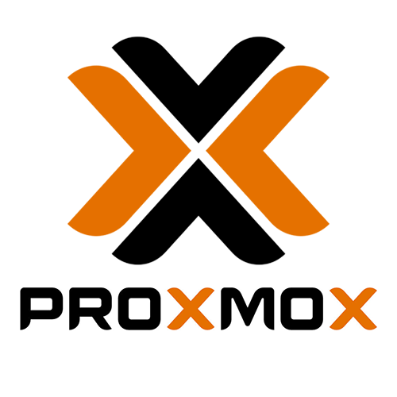
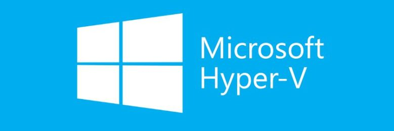

Hypervisors are software that enable virtualization, the process of creating and running multiple virtual machines (VMs) on a single physical server. Virtualization can improve the efficiency, scalability, and security of your IT infrastructure, but choosing the right hypervisor can be challenging.
In this post, we will compare two popular hypervisors: [Proxmox](https://proxmox.com/) and [Hyper-V](https://learn.microsoft.com/en-us/windows-server/virtualization/hyper-v/hyper-v-technology-overview). We will look at their features, pros and cons, and use cases to help you decide which one is best for your needs.

## What is Proxmox?

Proxmox is an open-source, Debian-based hypervisor that supports both KVM and LXC virtualization technologies. Proxmox has a web-based interface that allows you to manage VMs, containers, clusters, and backups with ease. Proxmox also has a strong community support and extensive documentation.

If you want a quickstart guide on installing a setting up Proxmox at home, check out our video guide.


## What is Hyper-V?

Hyper-V is a Microsoft product that allows you to create VMs on Windows-based systems. Hyper-V integrates well with other Microsoft products and services, and offers advanced security features, such as Shielded VMs and Host Guardian Service. Hyper-V also supports live migration and load balancing of VMs.

## Proxmox vs Hyper-V: Features Comparison
Here is a table that summarizes the main features of Proxmox and Hyper-V:

Feature	| Proxmox | Hyper-V
--- | --- | ---
Software Type | Open source | Proprietary
BaseOS | Debian Linux + KVM | Windows Server, 10, 11
Central Management | Yes | Yes
Clustering | Yes | Yes
High Availability | Yes | Yes
Storage and Backup API | Yes | Yes
Live Migrations | Yes | Yes
VM Load Balancing | Yes | Yes
Virtualized Networking | Yes | Yes
GPU Passthrough | Yes | Yes
Snapshots | Yes | Yes
ZFS Storage Support | Yes | No
Management | Web Based, Shell | Graphical Interface, PowerShell

## Proxmox vs Hyper-V: Pros and Cons

Both Proxmox and Hyper-V have their advantages and disadvantages, depending on your specific requirements and preferences. Here are some of the pros and cons of each hypervisor:

### Proxmox Pros
- Free to use with full features
- Supports both KVM and LXC virtualization
- User-friendly web interface
- Cluster management and high availability features
- Strong community support and documentation

### Proxmox Cons
- Steeper learning curve for users unfamiliar with Linux
- Limited support for Windows virtualization
- Less enterprise-grade support options

### Hyper-V Pros
- Seamless integration with Microsoft products and services
- Excellent support for Windows-based workloads
- Advanced security features, such as Shielded VMs and Host Guardian Service
- Live migration and load balancing features
- Multiple pricing plans and support options
### Hyper-V Cons
- Higher licensing costs
- Limited compatibility with older hardware configurations
- Less support for Linux and other non-Windows operating systems

## GPU Passthrough
There are many cases where you may want to passthrough a GPU from the host device to your VMs. GPU Passthrough is possibility in both Promox and Hyper-V, although the process has some differences.

### Proxmox GPU Passthrough
To enable GPU passthrough on Proxmox, you need to have a compatible CPU, motherboard, and GPU that support IOMMU and interrupt remapping. You also need to enable these features in your BIOS or UEFI settings. Then, you need to add some parameters to the boot file of Proxmox, such as ```intel_iommu=on``` or ```amd_iommu=on```, depending on your processor. You also need to blacklist the drivers of the GPU on the host system, so that it is not used by Proxmox. Finally, you need to add the GPU device to the VM configuration, using the hostpci option. You can find more details and examples on how to do this in the [Proxmox wiki](https://pve.proxmox.com/wiki/PCI%28e%29_Passthrough).

### Hyper-V GPU Passthrough
There are different methods to enable GPU passthrough on Hyper-V, depending on the version of Windows and the type of graphics card you have. Here are some of the possible options:

- RemoteFX: This is an older feature that was removed from Windows 10 and Windows Server 2019 due to a security issue. It allowed you to add a RemoteFX Video Adapter to a VM and use the host’s GPU to accelerate graphics rendering. You can still use this feature on Windows Server 2016 or earlier, or on Windows 10 version 1803 or earlier, but it is not recommended for security reasons.
- Discrete Device Assignment (DDA): This is a feature that allows you to pass an entire PCIe device into a VM. It works with most graphics cards that support Single Root I/O Virtualization (SR-IOV). You need to configure the VM for DDA, dismount the device from the host, and assign the device to the guest. You can find more details on how to do this here: [Discrete Device Assignment](https://learn.microsoft.com/en-us/windows-server/virtualization/hyper-v/deploy/deploying-graphics-devices-using-dda).
- GPU Partitioning: This is a newer feature that allows you to partition off resources from your graphics card and share them among multiple VMs. It works with some graphics cards that support GPU-PV technology. You need to enable the GPU partitioning driver on the host, add a GPU partition adapter to the VM, and update the GPU driver on the guest. You can find more details on how to do this here: [GPU Partitioning](https://www.tenforums.com/virtualization/195745-tutorial-passing-through-gpu-hyper-v-guest-vm.html).

## Proxmox vs Hyper-V: Use Cases
The best hypervisor for you depends on your use case and the type of workloads you want to run. Here are some general guidelines to help you choose between Proxmox and Hyper-V:
- Choose Proxmox if you want a free, open-source, and flexible hypervisor that supports both KVM and LXC virtualization. Proxmox is ideal for Linux-based workloads, and for users who are comfortable with Linux administration and command-line interface.
- Choose Hyper-V if you want a Microsoft product that integrates well with other Microsoft products and services. Hyper-V is ideal for Windows-based workloads, and for users who prefer a graphical user interface and Windows PowerShell.

## Conclusion
Proxmox and Hyper-V are both powerful and popular hypervisors that offer a range of features and benefits for virtualization. However, they also have their limitations and trade-offs, depending on your use case and preferences. Therefore, you should carefully evaluate your needs and compare the pros and cons of each hypervisor before making a decision.

Personally, I have used both and while Proxmox has more features and is easy to manage from the web based interface, Hyper-V is something you will more than likey run into in the workplace. Even more common Hypervisors in the workplace are VMware ESXi and Citrix using Vitual Machine Manager.

We hope this post has helped you understand the differences between Proxmox and Hyper-V, and how to choose the best hypervisor for your needs. If you have any questions or feedback, please let us know in the comments below. Thank you for reading!

