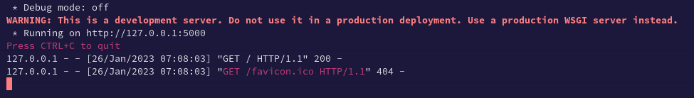
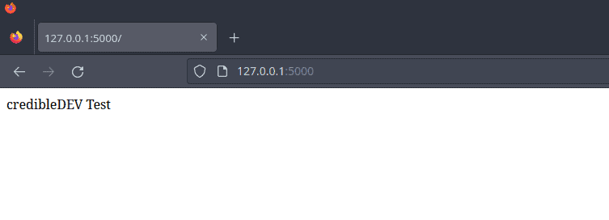
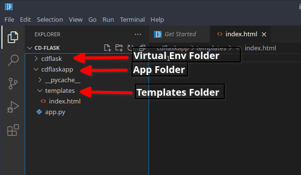
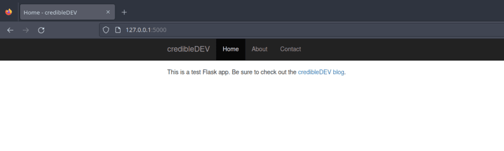
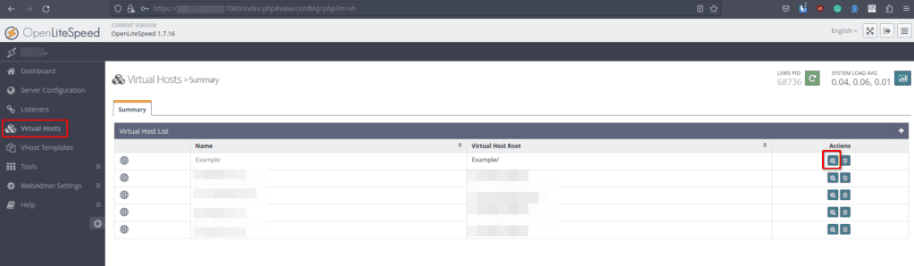
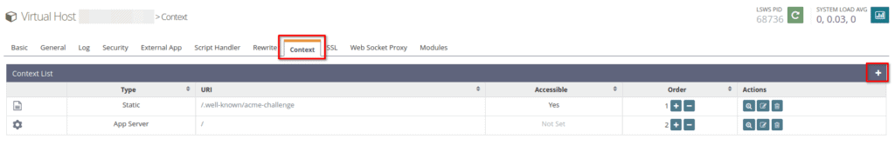
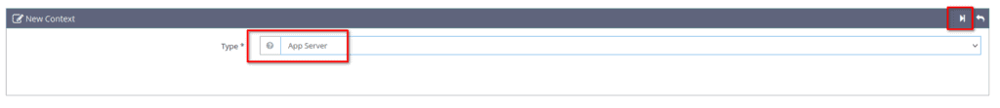
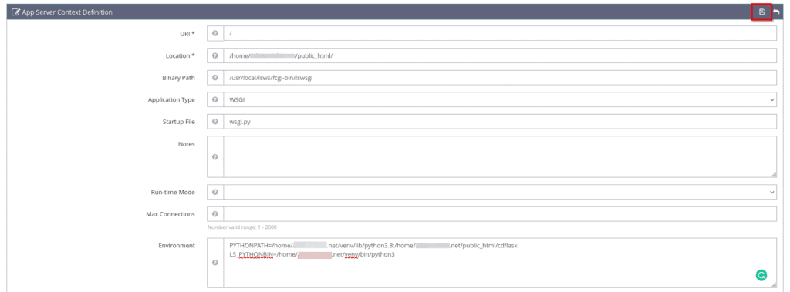
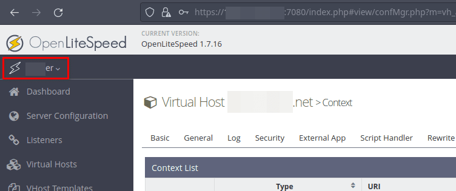
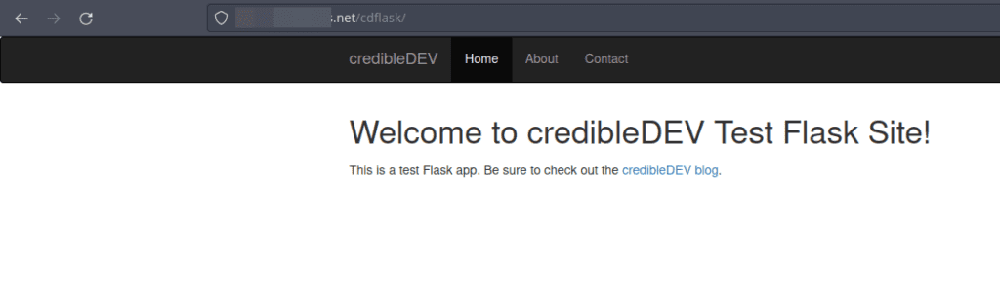

Python Flask is a small web development framework written in Python. It allows you to create web applications quickly and easily by providing useful tools and features. You can use it to create a website, a web service, or even a simple web page. It's easy to learn and use, making it a popular choice for beginners and experienced developers alike. Personally, I love Flask. You can quickly spin up a website using the Jinja2 template engine or create a web API to query a backend database or other web API.

Today, we will set up a Python Flask development environment on Manjaro Linux and then deploy it to a production server running CyberPanel on Ubuntu 22.04 and the OpenLiteSpeed webserver. Let's get started.

**Note:** While this guide is written specifically for Manjaro, it will work with other Arch based Linux distributions like EndeavourOS as well.

## Step 1 - Install Python on Manjaro Linux

Python should already be installed, as it's typically a default application on Manjaro. Let's double-check by running the following command in the terminal, which should return the specific version of Python installed on your Manjaro machine.

```
python3 -V
```

If Python is installed on your system, you should see something similar to the following output in the terminal. The version number may be different for you but that's OK.

```
Python 3.10.9
```

If you don't see Python installed on your Manjaro machine, you can use [pacman](https://credibledev.com/how-to-use-pacman-on-manjaro-linux/) to get it installed pretty easily. Just run the following command to install the latest available version.

```
sudo pacman -S python3
```

## Step 2 - Install Pip for Python 3

The next thing we should do is install "pip". Pip is a package manager for Python that we will use to install Flask and other packages that our web app may need. Think of this as the pacman or apt for Python. To install "pip" on Manjaro, run the following command.

```
sudo pacman -S python-pip
```

## Step 3 - Set Up a Virtual Environment

Virtual environments are important for Python development because you may be working on many Python projects which all share different dependencies. You could have a scenario where you need one version of a package for this app but another version for a different app. A virtual Python environment allows you to separate those projects and their dependencies so that the packages installed are specific to that environment.

To set up a new Python virtual environment we will use "venv" to create an environment called "cdflask" for example.

```
python3 -m venv cdflask
```

Next, we need to activate this new virtual environment. Once activated, the "pip install" commands will install packages just to that environment. Just swap out "cdflask" with whatever you named your environment.

```
source cdflask/bin/activate
```

You'll notice that your terminal prompt has changed a bit. It should show (your\_environment\_name) \[username@hostname foldername\] or something similar. The important part is that it should show your chosen virtual environment name in parenthesis, this means your virtual environment is now activated.

## Step 4 - Install Flask in the Python Virtual Environment

Now that we have the virtual environment set up and activated, we can install the Flask package using pip.

```
pip install flask
```

## Step 5 - Create a Basic Flask App.py File

Flask is now installed, so we are ready to create the "app.py" file which will be our entry point that will display some text as a web page to test everything is working. Open up your favorite editor and create an "app.py" file inside your virtual environment.

First create a new directory to hold the source files for the app, we will call this folder "cdflaskapp" for example.

```
mkdir cdflaskapp
```

Now go ahead and create your "app.py" in this new directory with the following Python code as an example and save the file.

app.py

```
from flask import Flask
app = Flask(__name__)

@app.route('/')
def index():
    return 'credibleDEV Test'

if __name__ == '__main__':
    app.run()
```

## Step 6 - Start the Flask Development Server

To test the flask application, head back to your terminal and run the following command.

```
flask run
```

Assuming everything went OK, you should see the output in the terminal similar to the following.



Great, this means your Flask app is running. As the output suggests, you can load up a browser and head to http://127.0.0.1:5000 to test your app. You should see something like this if everything worked as expected.



Let's create a little more fancy using a Jinja2 template and the Bootstrap CSS framework, then we will deploy it to our production OpenLiteSpeed server to show you how that works.

## Step 1 - Creating a Simple Website Using a Jinja2 Template

To get started using Jinja templates with our Flask app. Let's create a new directory within our app folder called "templates". Then, create an "index.html" file in the templates directory. Afterward, our directory structure should look like the following.



Inside of our "index.html" file, let's add the following code as an example.

index.html

```
<!-- This pulls in the base html file we will create in a moment -->

<!-- This sets to title variable in the base.html file -->
Home
<!-- Everything within this block body will have the base.html applied around it -->

    <h1>Welcome to {{ sitename }}!</h1>
    <p>This is a test Flask app. Be sure to check out the <a href="https://credibledev.com">credibleDEV blog</a>.</p>

<!-- End the block body tag -->
```

Notice that we don't have the typical open HTML tags or the head tag. We will handle those in separate files so they are uniform across all the pages of our Flask site. This way, each new page we create only needs to have the body or content of the page. The header and footer can be pulled in from the base templates we make for them.

To clarify, the content that appears between the ** and ** tags in the **index.html** file, will be inserted between the ** and ** tags of the **base.html** file that we are about to create.

Let's create a "base.html" file now, so we can put in the standard HTML tags, header, and CSS. This file would include everything that we want to be uniform across the entire site, such as a fancy header for example. We will also have the block body Jinja tag that will pull in the content of other files, like the index.html file for example. Also, the title Jinja variable that is in the index.html file will be inserted into the block title variable of the base.html file.

This will all make more sense when you start playing around with it and run a test.

base.html

```
<!doctype html>
<html lang="en">
<head>
  <title> - credibleDEV</title>
  <meta name="viewport" content="width=device-width, initial-scale=1">
  <link rel="stylesheet" href="https://cdn.jsdelivr.net/npm/bootstrap@3.4.1/dist/css/bootstrap.min.css"     integrity="sha384-HSMxcRTRxnN+Bdg0JdbxYKrThecOKuH5zCYotlSAcp1+c8xmyTe9GYg1l9a69psu" crossorigin="anonymous">
</head>
<body>
<!-- Start NavBar -->
<nav class="navbar navbar-inverse">
      <div class="container">
        <div class="navbar-header">
          <button type="button" class="navbar-toggle collapsed" data-toggle="collapse" data-target="#navbar" aria-expanded="false" aria-controls="navbar">
            <span class="sr-only">Toggle navigation</span>
            <span class="icon-bar"></span>
            <span class="icon-bar"></span>
            <span class="icon-bar"></span>
          </button>
          <a class="navbar-brand" href="#">credibleDEV</a>
        </div>
        <div id="navbar" class="collapse navbar-collapse">
          <ul class="nav navbar-nav">
            <li class="active"><a href="#">Home</a></li>
            <li><a href="#">About</a></li>
            <li><a href="#">Contact</a></li>
          </ul>
        </div><!--/.nav-collapse -->
      </div>
    </nav>
<!-- End NavBar -->
  <div class="container">
    <div class="starter-template">
    <!-- Page Content Here -->
    
    
    <!-- End Page Content -->
    </div>
  </div>
</body>
</html>
```

To test this out, we need to make a modification to the app.py file that we created earlier. We need to tell the Flask app to use Jinja with the render\_template function and pass it in our index.html file so that it displays when users visit our site. We will also pass a variable to the template that will show up in the Welcome to {{ sitename }}! part of our index page. Additionally, we need to add an import at the top for render\_template.

app.py

```
from flask import Flask, render_template
app = Flask(__name__)

@app.route('/')
def index():
    sitename = "credibleDEV"
    return render_template("index.html", sitename=sitename)

if __name__ == '__main__':
    app.run()
```

## Step 2 - Testing our Flask App

Now that everything is updated, let's test it out. If you still have the "flask run" command executing in your terminal, press CTRL+C to shut it down. Then launch it again using "flask run". You can then refresh the page or open a new tab and go to http://127.0.0.1:5000 once again. You should see that your page looks much nicer now.



Awesome, what a beautiful start to a site, without much work at all. Now it's time to deploy this Flask website to our production OpenLiteSpeed server.

## Step 3 - Set Up Our Flask App to Run on the Litespeed Server

The production server is running on Linode, with Ubuntu 20.04, the CyberPanel management panel, and OpenLiteSpeed. Your setup may be different, such as Apache for example. So the steps may be slightly different for you in that case. The important thing here is that while you could technically just run the Flask app directly on the production server, that's not what you want to do. You want OpenLiteSpeed, Apache, or whatever web server software, to handle the HTTP request and deliver your site to the end user.

### Install Python and Pip on Ubuntu CyberPanel Server

The first thing we need to do is get Python3 and Pip installed on our Ubuntu server. So go ahead and SSH into your server to get a terminal, then run the following command.

You need to SSH with a root account or one that has sudo privileges.

```
sudo apt install python3 python3-pip
```

### Install the wsgi-lsapi Package

Next, we need to install the wsgi-lsapi package from LiteSpeed. You can find more information on the official [LightSpeed API Downloads](https://www.litespeedtech.com/open-source/litespeed-sapi/download) page, look for "Python Module". Run the following commands to complete the installation for wsgi-lsapi.

```
curl -O https://www.litespeedtech.com/packages/lsapi/wsgi-lsapi-2.1.tgz
tar xf wsgi-lsapi-2.1.tgz
sudo mv wsgi-lsapi-2.1 /usr/local/lsws
cd /usr/local/lsws/wsgi-lsapi-2.1
python3 ./configure
make
sudo mv lswsgi /usr/local/lsws/fcgi-bin
```

### Setup a Python Virtual Environment on our Server

Now you need to SSH as the hosting account user instead of root. You may need to enable and set up SSH access for the account from CyberPanel. To do this, use the menu on the left of CyberPanel, click Websites, List Websites, and click on manage for the website you are setting up. At the top, there is a button to set up SSH access.

After getting everything installed above, it's time to set up a new virtual environment on our server. If you're using cyberpanel, your websites are likely listed in the /home directory, so /home/example.com. Use the terminal to CD to that directory.

```
cd /home/example.com
```

Now we set up and activate the virtual environment using Python. You can call it whatever you like, I chose cdflask here.

```
python3 -m virtualenv venv
source venv/bin/activate
```

### Install Flask in our Python Virtual Environment

We are ready to install the Flask package inside our virtual environment now.

```
pip3 install flask
```

### Create a Directory for our App Files

Now we need to create a directory to upload our Flask app.

```
mkdir /home/example.com/public_html/cdflask
```

Next, upload the files we created earlier to this directory. You can use the CyberPanel file manager, SFTP, or whatever method you like. Don't get too excited yet, we need to add a new file and edit our app.py file as well before we are finished. Almost there though.

### Setup our wsgi.py File and Edit app.py

Create a new file in the public\_html directory called "wsgi.py". Put the following in that file, swap out the "from cdflask" part to match your directory though if you chose a different name.

/home/example.com/public\_html/wsgi.py

```
#!/usr/bin/env python
import sys

sys.path.insert(0, '/home/example.com/public_html')

from cdflask import app as application
```

Next, rename your **app.py file to \_\_init\_\_.py** and remove the if statement and app.run section that was at the bottom so it looks like this.

/home/example.com/public\_html/cdflask/\_\_init\_\_.py

```
from flask import Flask, render_template
app = Flask(__name__)

@app.route('/')
def index():
    sitename = "credibleDEV Test Flask Site"
    return render_template("index.html", sitename=sitename)
```

### Configure LiteSpeed to Run our Python Flask App

We have our app files configured so the next step is to configure the LiteSpeed web server to run our Flask app for us and then serve it to users from the http://example.com/cdflask address. You can also serve it from the root of the domain if you wish, that's up to you. To do that, you will want to change the URI setting in the next section to be just "/" instead of "/cdflask".

To get started, head to your LiteSpeed WebAdmin page, typically accessed on port 7080. Once there, choose "Virtual Hosts" from the left-side menu. In the list of domains, click the magnifying glass next to the domain you want to set up Flask on.



On the next page, click the "Context" tab and then click the Add button found on the right.



On the following page, you will select "App Server" as the type and then click the poorly designed next button.



Now we will configure the specifics so that LiteSpeed will run and show our Python Flask app to the end user. Remember, if you want users to see your page by going to http://example.com/ then change the URI here to "/".

- URI - /cdflask

- Location - /home/example.com/public\_html/cdflask

- Binary Path - /usr/local/lsws/fcgi-bin/lswsgi

- Application Type - WSGI

- Startup File - wsgi.py

- Environment - PYTHONPATH=/home/example.com/venv/lib/python3.8:/home/example.com/public\_html/cdflask

- Environment - LS\_PYTHONBIN=/home/example.com/venv/bin/python3



Once you're finished, click the save button at the top right. You will be instructed to gracefully restart the server. You can do this by clicking on your hostname at the top left of the page and choosing "Graceful Restart" from the popup menu.



### Testing our Python Flask App with LiteSpeed

After running the graceful restart, you are ready to test your site.



### Troubleshooting and Changes

If you run into issues getting your Python Flask app to run on LiteSpeed and you need to make modifications. Run the following in the terminal to restart the app to test out your changes. You will also do this if you update the website or app.

```
sudo killall lswsgi
```

## Conclusion

Congrats! You now have learned how to set up a Python app to run on LiteSpeed using CyberPanel. If you run into issues or have any questions, let me know in the comments!
