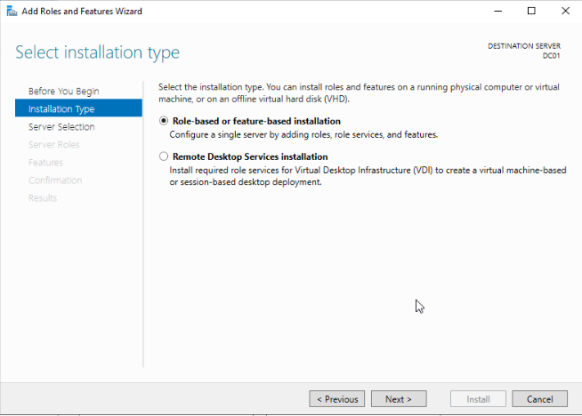
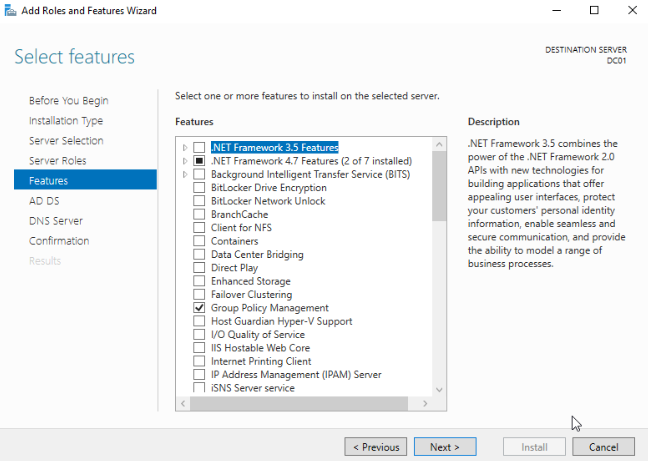
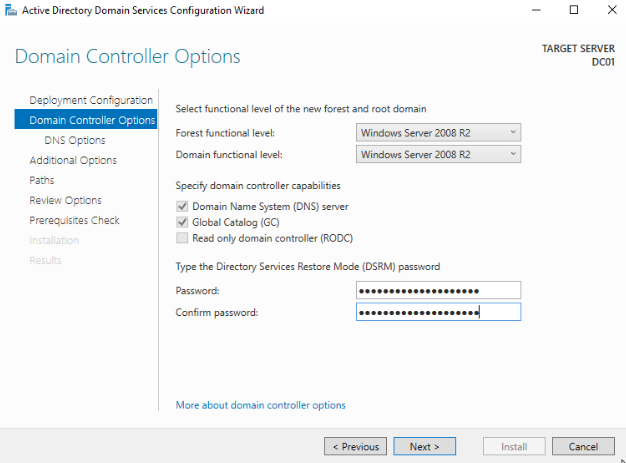

If you are setting up a Proxmox Active Directory lab environment and are looking to install a Windows Domain Controller on [Proxmox](https://www.proxmox.com/), this is the guide for you. Today we will walk through the installation and configuration of Windows Server 2019 and promote it to be a domain controller, all inside Proxmox. After completing this guide you will have a functional domain controller that you can then manage devices, virtual machines, users, and groups. Let's go ahead and hop into Proxmox and create a new VM. Be sure to have a Windows Server 2019 ISO to install the OS with before proceeding. If you don't have that, you can grab an [evaluation copy from Microsoft](https://www.microsoft.com/en-us/evalcenter/evaluate-windows-server-2019).

## Proxmox Virtual Server Setup

Below is a screenshot of how I have configured my virtual machine for the Windows Server 2019 Domain Controller on Proxmox, you can copy these settings if you'd like.

Remember to assign the Windows server ISO to the VM before powering it on, then you can follow along for the rest of the installation and configuration.

## Windows Server 2019 Install on Proxmox

1. After the initial OS install is complete, the first boot into the OS will ask you set up an administrator password. 

3. You can now log in to your new Windows 2019 Server and start the configuration for a Domain Controller.

5. Once logged in, let us go ahead and rename the computer so it is not the default name that the windows install gave it. Right-click on the start button and choose Run. In the box type in sysdm.cpl and press enter. In the System Properties dialog box, click on Change next to the option to rename the computer and give the system an appropriate name such as DC01 for example. The system will want to restart, go ahead and do this.

7. You will also want to configure a static IP address in most cases.

## Configure Domain Controller on Proxmox

We are now ready to promote the server to a Domain Controller which is actually a pretty simple task. Let's do that now.

1. In Server Manager, you should see an option to Add Roles and Features on the main page. If not, you can choose the Manage menu at the top right corner of the Server Manager page and find it there. Click Add Roles and Features to launch the wizard.

3. Choose Role-based or Feature-based installation
    1. 

5. Choose your server from the list. Depending on your environment you may have more than one choice here.
    1. 

7. Select Active Directory Domain Services and DNS Server from the list of options.
    1. 

9. On the next screen, you can keep the default options unless you have something specific to install for your use case.
    1. 

11. Continue to click next through the information pages that come next. You will come to a confirmation page where you can click install, go ahead and complete the installation.
    1. 

13. Once the installation has completed, you will have the option to promote the server to a domain controller, go ahead and choose this option.
    1. 

15. If this is your first domain controller for your network, choose to Add a new Forest and supply the domain name.
    1. 

17. On the next page, you will need to select the functional level of the domain controller and forest. I’m choosing 2008 R2 here, only because I know that I plan to add a Linux Domain Controller later and 2008 is a requirement for that. You can keep the default here or whichever option suits the needs of your environment. You will also set up a Restore Mode password, which is the password needed for AD restoration if the need ever arises.
    1. 

19. Complete the process by accepting the default options through the remaining screens. When you reach the final screen, click Install to complete the Installation. The server will reboot during this process.

21. After restarting the service, you should now be connected to the domain. You can verify this on the system properties page.
    1. 

23. Your domain controller on Proxmox is now complete, you can proceed with creating domain user accounts.

## Create OU's and a Domain User Account

1. We will proceed with creating some Organizational Units and a Domain Admin account. To do this, we should launch Active Directory Users and Computers. This can be found in the start menu or in the Server Manager under Tools.
    1. 

3. If we right-click on our domain name, in my case, cdlabs.net, then choose New and Organizational Unit, we can create a new OU called HomeLab. You can call this whatever you like. Then right-click the new OU and create 2 more underneath HomeLab named Computers and Users like so.
    1. 

5. Now, we can create our domain admin user. Right-click on the Users OU and go to New, then choose user. Fill out the details for the new user account. Ensure you select a secure password, as this user will have a lot of control with domain admin rights.
    1. 

7. Once your new user is created, you can right-click on the user and choose to add to a group. In the dialog box, type domain admins and press enter.

9. As a final step, you will want to set up a static IP address for your domain controller so that you can point your endpoints to the DC as their DNS server when joining the domain. The settings for this will be dependent on your environment.

At this point, you have successfully installed and configured a Windows Domain Controller on Proxmox and you can now build additional VMs to join your Windows domain. In a future post, I will show you how to join your On-Prem domain controller to Azure AD and begin syncing them. If you have any questions or want to see a specific guide, leave those in the comments. Thanks!
