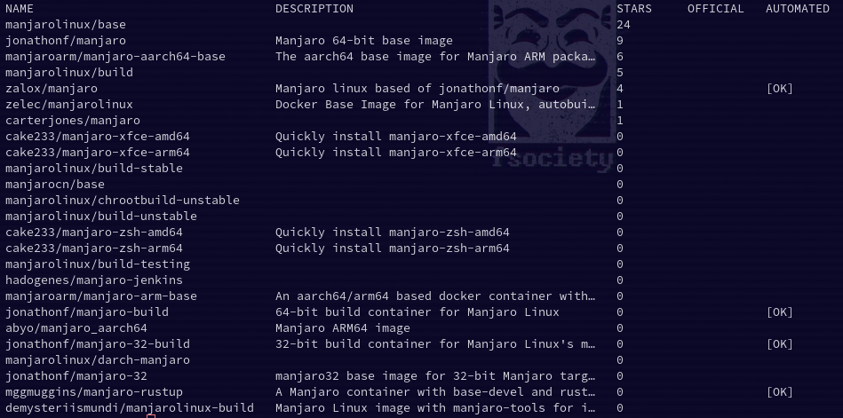

## What is Docker?

Docker is a platform and tool for building, shipping, and running distributed applications. It allows developers to package their applications and dependencies into a portable container, which can be run on any machine that has Docker installed. This makes it easy to create, deploy, and run applications in a consistent environment, regardless of the host operating system or infrastructure.

## Docker vs Virtual Machines

ocker and virtual machines (VMs) are both technologies for running multiple isolated environments on a single host, but they work in different ways.

A virtual machine is a software implementation of a physical machine, which runs on a host operating system and emulates all the hardware resources of a physical computer. Each VM runs its own operating system, and applications running inside the VM are isolated from the host and from other VMs.

Docker, on the other hand, uses the host operating system's kernel and does not run a separate operating system for each container. Instead, it uses a feature of the Linux kernel called namespaces to create isolated environments for applications. This means that Docker containers are much more lightweight than VMs, and require fewer resources to run.

Another difference is that VMs are typically used to run different operating systems while a Docker container is used to package an application and its dependencies in a portable container, allowing it to run consistently across different environments.


## Step 1 - Install Docker

To install Docker on Manjaro Linux or other Arch based distros, you can use [pacman.](https://credibledev.com/how-to-use-pacman-on-manjaro-linux/) Open a terminal and run the following command to install Docker.

```
sudo pacman -S docker
```

## Step 2 - Start the Docker Service

The next step is to start the Docker service. We can also use "systemctl enable" to make Docker run as a system startup service, this means that Docker will start itself after a reboot. Run the following commands in the terminal.

```
sudo systemctl start docker.service
sudo systemctl enable docker.service
```

## Step 3 - Add User to Docker Group (Optional)

This step is optional but by default, the Docker commands need to be run as root. If you don't wish to run them as root, you can add yourself to the docker group.

This change will not take effect until your log out and back in again.

```
sudo usermod -aG docker $USER
```

## Step 4 - Search for a Docker Image

You may already know the name of the Docker image you want, or maybe you're creating your own. If not, there are plenty of available Docker images and you can search through them using the command below. In our example, we will search for Manjaro Docker images.

```
sudo docker search manjaro
```

This search will return a list of available Docker images.



## Step 5 - Install a Docker Image

To install a Docker image, you will need to know the name of the image. In our example, we will use "[marjarolinux/base](https://hub.docker.com/r/manjarolinux/base)" from the search we just did. To install this Docker image, we run the following command.

```
sudo docker pull manjarolinux/base
```


Wait patiently while the image is downloaded. If it is successful you will see output similar to the following.

## Step 6 - Run a Docker Image

Now that we have a Docker image selected and downloaded, we are ready to launch it. Simply run the following in the terminal to spin it up. We use "-it" here to run the Docker container in interactive mode. If we don't use "-it", the Docker container would just exit immediately and nothing would happen. Since we use "-it", we will be dropped into the shell prompt of the Docker container.

```
sudo docker run -it manjarolinux/base
```

Once you're at the terminal, you can run any Linux commands you want. You might install Apache to host a website. Maybe you want to [set up NodeJS](https://credibledev.com/how-to-install-nodejs-on-manjaro-linux/) so you can host an API? The choice is yours and so is the container.

You could also just send a command to the Manjaro Docker container instead. If you wanted the container to check for updates you could do the following.

```
sudo docker run -it manjarolinux/base pacman -Syu
```

## Step 7 - Check the Status of Running Docker Containers

Now that we have our Manjaro Linux container up and running, we can check its status a few different ways.

First, to get a quick status of all running containers run the following in a new terminal.

```
sudo docker container ls
```


You can also get live stats of your Docker containers by running the following command.

```
sudo docker stats
```

## BONUS: How to Copy Files to and From a Docker Container

It's a pretty common scenario that you might want to copy files from your local machine to the Docker container. To do that, imagine you have a file called test.js on your local machine and you want to copy it to the Docker container. First, you need to get that container id, which you can get using the "sudo docker ps" command. This will list all of your containers, and grab the id of the one you want, it will be in the first column of the output.

```
sudo docker ps
```

Now that you have the container id, use the following command to copy the file to the container. Replace "fc40117da262" with your container id and "foldername" with the folder to which you want to copy the file.

```
docker cp test.js fc40117da262:/foldername/test.js
```

You can read more about the "docker cp" command and the more advanced options by checking out the [official documentation](https://docs.docker.com/engine/reference/commandline/cp/).

## Conclusion

You have now successfully set up Docker on Manjaro Linux. Time to get developing your next app!

Have questions? Let me know in the comments.
