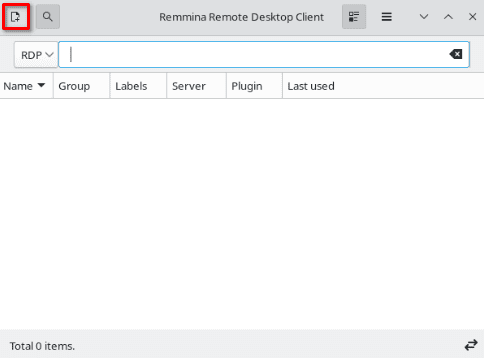
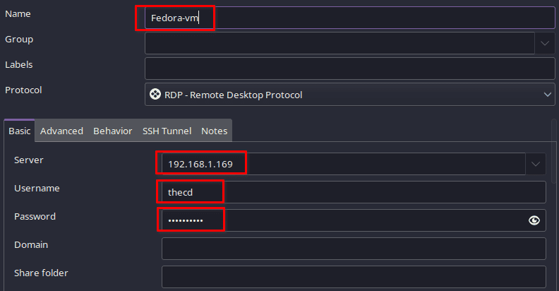
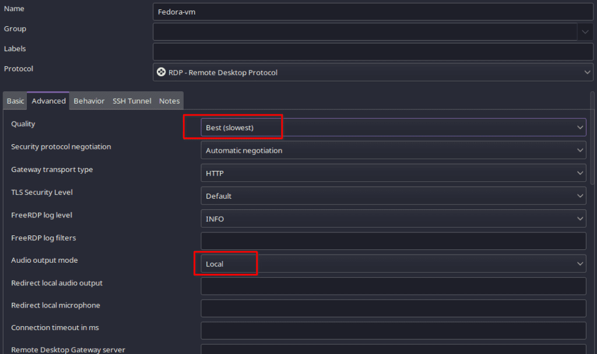
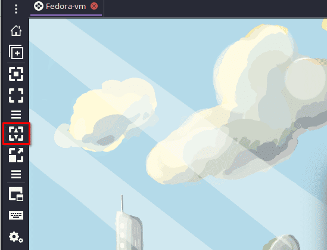

I recently rebuilt my Proxmox server and decided that I wanted to give Fedora 37 with KDE Plasma 5.27 a spin. It's not ideal to always use the console built into Proxmox for remote desktop, as the experience is not the best. To improve the experience, I was going to install and [set up XRDP to get the best speed and experience](https://credibledev.com/xrdp-and-vnc-which-is-the-better-remote-desktop/) possible while connecting from my main Manjaro laptop.

Here, I've documented how to XRDP on the Fedora virtual machine and set up the connection on my Manjaro machine using Remmina.

## Step 1: Install XRDP on the Fedora VM

The installation is pretty simple, we just need a couple of commands.

```
sudo dnf install xrdp
```

After installing xrdp, we need to set up the service so that it runs after a reboot.

```
sudo systemctl enable xrdp
```

To start xrdp now, we use the following command.

```
sudo systemctl start xrdp
```

## Step 2: Installing Remmina

Back on the device we will be connecting from, we need to install a remote desktop client to make the connection to xrdp on Fedora. I really like Reminna for this, it works well with connecting to both Linux and Windows devices.

### Manjaro or Arch Linux

On Manjaro, we can install Remmina from the command line using [pacman](https://credibledev.com/how-to-use-pacman-on-manjaro-linux/) or from the GUI software installer pamac. You have multiple options for which repository you install Remmina from, such as [Flathub](https://credibledev.com/install-flatpak-endeavouros-manjaro-arch-linux/), the official Manjaro repo, or the AUR. Typically I would recommend using the Flatpak version, but in the case of Remmina, I've had issues with remote sound when connecting to Windows devices.

Based on my experience, I would recommend installing it from the [AUR](https://credibledev.com/how-to-enable-the-aur-on-manjaro-linux/). The "remmina-git" version has worked for me.

```
yay -S remmina-git # install from the AUR
sudo pacman -S remmina # install from the official repo
flatpak install flathub org.remmina.Remmina # install from Flathub
```

### Ubuntu

For Ubuntu, we need to add an additional repo to get Remmina installed.

```
sudo apt-add-repository ppa:remmina-ppa-team/remmina-next
sudo apt update
sudo apt install remmina remmina-plugin-rdp remmina-plugin-secret
```

Alternatively, you can install the Snap package on Ubuntu. I wouldn't recommend this unless you know the snap version has been updated, sometimes they can lag behind the repo listed above.

```
sudo snap install remmina
```

### Fedora

We can use dnf to install Remmina on Fedora.

```
sudo dnf install Remmina
```

## Step 3: Connecting to Fedora

Now that we have the Remmina remote desktop client installed, we can make our XRDP connection to the Fedora virtual machine.

Note: If you are connecting to the remote machine using Windows, you can use the built-in Remote Desktop Client from Microsoft.

When you open Remmina the first time, it should look similar to this. Click the icon at the top left to add a new connection.



You will need the IP address from the Fedora VM, to get this, you can run this command in the terminal on Fedora.

```
ip addr
```

Now you can fill in the details for the connection in Remmina. Provide the IP address, username, and password for the Fedora user account. Make sure you **choose RDP as the connection protocol** as well.



Once you have configured the details above, you can test the connection.

If you have multiple desktop environments installed and it's not defaulting to the one you want, you will need to set that up in a "~/.Xclients" file.

## Step 4: Set Desktop Environment for XRDP

In my example, I installed KDE with Gnome as the default but later installed KDE Plasma. So for my testing, I want KDE to run by default when connecting with XRDP. To do this we run the following commands on the Fedora VM to create the ".Xclients" file and make it executable.

```
echo "startplasma-x11" > ~/.Xclients
chmod a+x ~/.Xclients
```

After doing this, disconnect from your XRDP session if you had one open, then reconnect again. This time, KDE should run by default.

## Step 5: Customize Your Remmina Session

There are many options available in Remmina to enhance your experience. Some that I like to change are the Quality and Remote Sound options.

Note: Remote sound with XRDP does not work currently if the machine you are connecting to uses Pipewire, such as Fedora. This function works fine with Pulseaudio clients and Windows though. See more: [https://github.com/neutrinolabs/xrdp/discussions/2023](https://github.com/neutrinolabs/xrdp/discussions/2023)



Setting the sound to local will allow the sound from the Fedora VM to be output on my local laptop.

## Step 6: Screen Resolution

In order to get the XRDP session to take up the full window, you can use this button in the Remmina connection interface. This button will dynamically adjust the resolution of the remote session.


