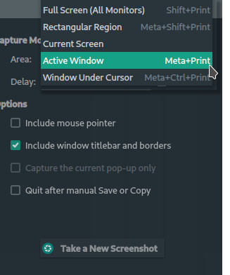
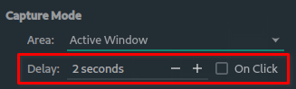
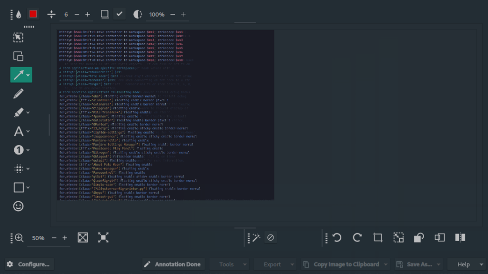

For someone who writes documentation all the time, screenshots play a big role in the documentation process. In my humble opinion, for Manjaro and other Linux distributions, [Spectacle](https://apps.kde.org/spectacle/) takes the cake when it comes to screenshot utilities.

Spectacle is actually part of KDE, which is how I was first introduced to it on the Manjaro Linux KDE edition. However, Spectacle can run outside of the KDE desktop environment. I still use Spectacle for every screenshot, even on my i3 window manager setup of Manjaro.

Don't just take my word for it, Spectacle offers a lot of features that make it a complete and easy-to-use screenshot utility for Linux. Let's break down some features and why I believe they are important and useful.

## Spectacle Capture Mode



In Spectacle, you can capture the screen or portions of the screen in all of the standard modes. If you want to capture all monitors at once, one screen, the current window, or a selection, Spectacle has you covered.

You also have additional options such as hiding or including the cursor in the screenshot or removing the window and title bars.

## Timer Delay on Screenshot



One would think that having a timer delay option would exist on all screenshot utilities, but it doesn't. I was surprised by this fact when exploring other tools for screenshots on my Manjaro Linux machine.

Timers and on-click options are very handy when you need to get a screenshot of a dropdown menu for example. This is a common task when writing documentation, Spectacle makes this a breeze.

## Easy Annotations for Screenshots



When taking screenshots for documentation, it is basically required that you annotate the image. Some examples of this are drawing arrows, highlighting, adding text, etc.

Spectacle has all of this built-in, so there is no need to export the screenshot to another image manipulation program (although you can, right from Spectacle).

Spectacle has a ton of built-in annotations. These save you a ton of time and frustration.

- Highlighting

- Arrows and Lines

- Blur and Pixelating (to hide information such as names, email, IP address, etc.)

- Text

- Numbers inside circles (for numbering steps for example)

- Shapes

- Emoji Stickers

## Installing Spectacle

You should be able to find Spectacle in the software manager for any Linux distro, just search for spectacle or use the following command line installs for your flavor of Linux.

#### Manjaro or Arch Install

```
sudo pacman -S spectacle
```

#### Debian or Ubuntu Install

```
sudo apt install spectacle
```

#### Fedora Install

```
sudo dnf -y install spectacle
```

#### Spectacle SNAP Package Install

```
sudo snap install spectacle
```

## Conclusion

Hopefully, you can see why Spectacle is my favorite Manjaro Linux screenshot utility and it works great on any flavor of Linux. Check out this post on my other [favorite Manjaro Linux apps](https://credibledev.com/favorite-manjaro-apps/).

Do you use a different screenshot utility? Let me know what it is in the comments!
