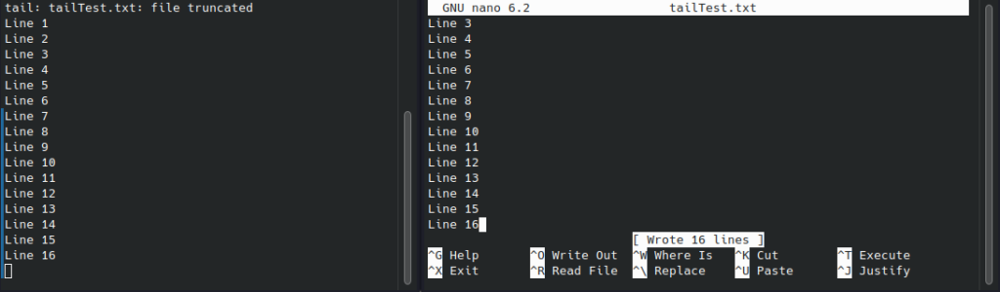

## What is the Tail Command?

Linux has a built-in command called [tail](https://man7.org/linux/man-pages/man1/tail.1.html) that can be used to view the last few lines of any file. Tail stands for “tail’ or “finalize” and it is used to show the last few lines of a file or stream. There are several situations when you might want to use tail. For example, you might use it while reading logs from another system, as an archive viewer - which shows the latest part of files - or even as a way of keeping track of changes made in your code by using commit logs. In this article, we will explain everything you need to know about tail command in Linux.

## Common Tail Command Options

#### Tail - Default Action

Simply running to tail command with a filename and no other options will display the last 10 lines of the file in the terminal window. The test file has 15 lines in it, as you can see, only the last 10 lines are printed on the screen.

```
tail filename
```


#### Tail -n Displaying a Specific Number of Lines

Maybe you want to run the tail command to get something other than the default 10 lines. This is exactly what the -n option is for. You can specify the exact number of lines that you want tail to output in the terminal. In the example below, we request 15 lines which is the entire document in this case.

```
tail -n 15 filename
```


#### Tail -f Track or Watch for Changes to a File

This is probably one of the most useful functions of the tail command in Linux. Using the -f option allows us to monitor a file for any new lines added. This is sometimes referred to as the "follow" command. Imagine you want to monitor a log file, using the -f option with tail can serve this purpose. In the first screenshot below, we see that we are monitoring the tailTest.txt file. We also have the file open in nano, prepared to add a new line as an example.

```
tail -f filename
```


Now we will add "Line 16" to the file. The tail window that is running the -f option should automatically update the output to show the new line added. This happens because using tail -f creates a live monitor on the file.



As we can see, tail picked up the change of us adding Line 16 to the file. You can continue monitoring for changes to the file. To end the monitoring in tails, you can press Ctrl+C in the terminal window.

## Next Step With the Tail Command

The tail command in Linux can be combined with other commands using the pipe |. Piping commands together can combine functionality and make tasks easier and more efficient for a Linux administrator. You can use the ls command for directory listings and pipe the output into the tail command. This will show a limited number of lines from the ls command output for instance.

```
ls -ltr | tail -n 3
```

Get creative with the tail command. What other commands would be useful to pipe with tail?

## Wrapup

Tail is a useful command in Linux that can be used to see the last few lines of a file before the file itself is finished. You can use the tail command in several situations, such as reading logs from another system, watching an archive, or even writing commit logs for your code. We hope you enjoyed reading about tail command in Linux. If you want to learn more about Linux, [check out our other articles](https://credibledev.com/category/linux/) on various topics. From tips and tricks to command line tricks and everything in between, we will make sure to cover them all.
