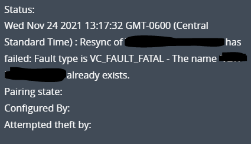

In your VMware Horizon VDI Environment, you can run into a range of different errors. Many of these errors either resolve themselves or can be resolved just by recovering or removing the machine from within the Horizon Administrator console. However, some VMware Horizon errors such as **VC\_FAULT\_FATAL - The name already exists**, cannot be resolved in this way.

## How to Fix the VC\_FAULT\_FATAL Error

Whenever you see this particular error, this means that Horizon is trying to create a new VM but can't because a VM with that name already exists. This can happen for many reasons but most commonly, the **VC\_FAULT\_FATAL - The name already exists** error occurs because Horizon can no longer communicate with the VM in vSphere. At some point, it lost sync with the VM and now the communication between Horizon and vSphere for this VM is broken.

The simplest way to resolve the **VC\_FAULT\_FATAL - The name already exists** error is to power off and remove the VM from the vSphere inventory. Just locate the VM in question within vSphere, make sure it's powered off, then right-click on the machine and choose "Remove from Inventory as shown here.

After removing the VM from inventory, you will need to go back to the Horizon Administrator Console, and select and delete the VM there as well. This will resolve the **VMware Horizon VC\_FAULT\_FATAL - The name already exists error message.**
