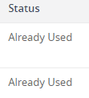
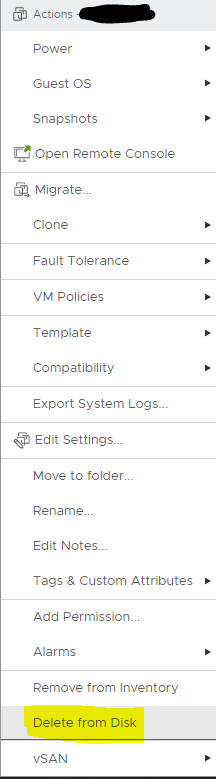

If you have been using VMware Horizon Instant Clone VMs for any length of time, it is likely that you have run across the VM status of, "Already Used". Typically, fixing the Already Used status is not as straightforward as just removing the VM from the Horizon View Admin page as other issues are.

## Fix Already Used Status in VMware Horizon

In order to fix machines in this status, you will need to log in and locate the machine in vCenter. Once you have located the problem VM, proceed to power off the machine. Once the VM is powered off in vCenter, you will then need to delete the VM using the "Delete from Disk" option. You can do this by using the right-click menu on the VM.

Once you have completed this work in vCenter, hop back over to the Horizon View admin console page and proceed to remove the VM there as well. Once the VM rebuilds it will no longer have the Already Used error.

## Permanent Fix for Already Used State in VMware Horizon

The fix provided above resolves the issue for a VM but does not keep it from occurring again. In order to fully resolve the issue, we must understand what is happening. The usual case for this issue is when a VM is left in a dirty state, caused by users shutting down the VM and not cleanly logging off or something unexpected happens with the VM causing a failure in clean logoff.

When your VM pool in Horizon is configured so that when users log off, the VM is recomposed, failure to cleanly log off or shutting down the VM can break this process of recomposing the VM.

To improve your chances of not seeing the Already Used issue again, you could remove the shutdown button from the OS that the VM runs.

Another solution involves editing a View LDAP value called pae-DirtyVMPolicy. This is found under OU=Server Groups, DC=vdi, DC=vmware, DC=int. The value is 0 by default which tells Horizon to set the VM as Already Used when the VM did not have a clean logoff. You can alter this value to 1 or 2, 1 will tell Horizon to let the VM be available without a recompose, and 2 will tell Horizon the refresh the dirty VM's.

You can also find more information about this issue in this VMware Knowledgebase Article: [The View virtual machine is not accessible and the View Administration console shows the virtual machine status as Already Used](https://kb.vmware.com/s/article/1000590)
