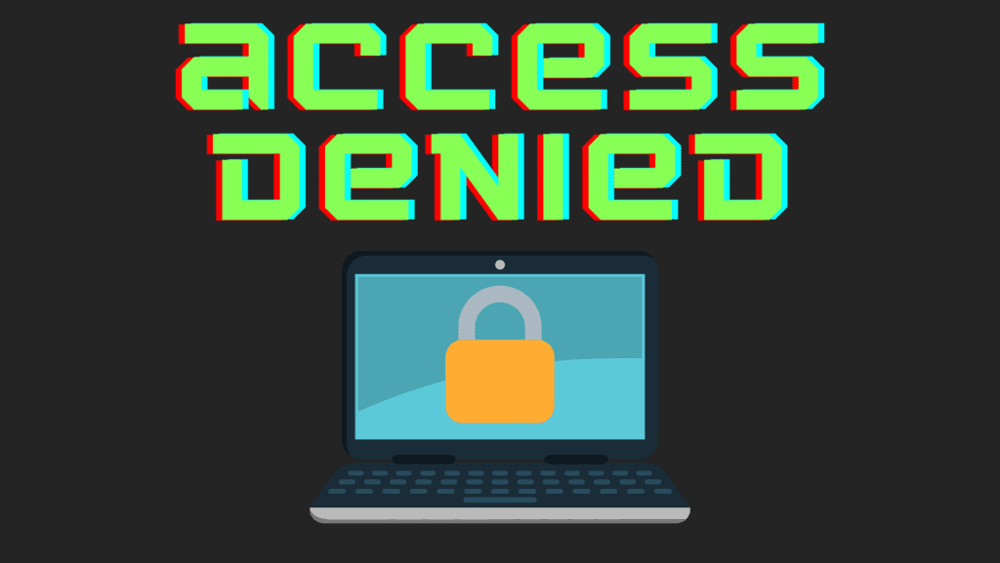
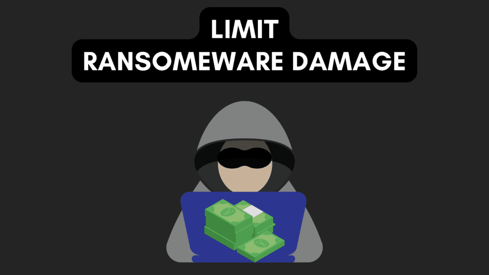

You may have seen the term immutable OS thrown around lately and wondered what it is and what is means. While an immutable OS isn't exactly new, they have become more popular in recent months. So let's break down what exactly an immutable OS is, how it can benefit you as well as the potential drawbacks of using one.

## Simple Description of an Immutable OS

An immutable operating system is pretty much like an unchangeable one. Imagine a computer system that once it's set up, can't be altered or modified in any way. It's like a locked box that can only be opened with a specific key, and once it's open, you can't change anything inside. This type of operating system is great for security purposes since it prevents any unwanted changes or tampering. Plus, it makes it easy to revert back to a previous state if something goes wrong. So, if you're looking for an ultra-secure operating system, an immutable one might be the way to go.

## What are the Benefits of an Immutable OS?

- **Security:** Since an immutable OS can't be modified, it eliminates the risk of unwanted changes or malware getting on your system.

- **Reliability:** If something goes wrong, you can easily roll back to a previous state and get the system back up and running quickly.

- **Easy Management:** Automated tools and scripts can be used to manage everything which saves a lot of time and hassle.

- **Downtime Reduction:** Updating an immutable OS is typically automated, which minimizes downtime and prevents errors.

- **Flexibility:** you can run multiple applications in different containers or virtual machines, which allows you to update or roll back an application without affecting the whole system.

- **Reduced Costs:** since the operating system is read-only, it means that there is no need to worry about keeping software up to date or configuring things manually, which can save you a lot of money in the long run.

- **Better Scalability:** Immutable infrastructure enables fast and reliable scaling of applications, as new servers can be quickly and easily provisioned with the same configuration as existing servers.

## What are the Drawbacks of an Immutable OS?

- Learning Curve: It may take some time to get used to working with an immutable operating system, especially if you're used to traditional operating systems.

- Limited Customization: Since the operating system is read-only, it can be more difficult to customize and configure it to suit your specific needs.

- Requires Containerization or Virtualization: To install or update software, you need to use containerization or virtualization techniques, which can be more complex than traditional methods. [Flatpaks](https://credibledev.com/install-flatpak-endeavouros-manjaro-arch-linux/) are great for an immutable OS since they already meet this requirement.

- Requires Extra Storage: Since you need to keep multiple copies of the operating system (to roll back to a previous state), it can require more storage space.

- Limited Software Availability: Some software may not be compatible with an immutable operating system, which can limit your options for running certain applications.

- More Steps to Update: Updating an immutable operating system requires more steps than traditional systems, and requires the creation of a new image of the operating system with updated software and then replacing the old one. This is typically automated in many situations though, so these steps would be transparent to the user.

## Will an Immutable OS Protect Against Ransomware Attacks?

An immutable operating system can help keep your computer safe from ransomware, but it's not a magic bullet. Since the operating system can't be changed, malware or ransomware can't make changes to it, which means it can't encrypt your files or cause damage. And if something does happen, you can easily roll back to a previous state and fix the problem. But, keep in mind that ransomware can still target your data, like the files on your shared network drive, so it's important to have a backup plan in place. Also, an immutable operating system can only protect you from ransomware that targets the operating system itself, it can't protect you from phishing scams or other types of attacks. So, while an immutable operating system is a good way to add an extra layer of security, it's not the only solution you should rely on.

## Does an Immutable OS Mean My Personal Files Are Immutable?

An immutable operating system just means that the operating system itself can't be changed, but it doesn't mean your personal files are also immutable. So, in most cases, your personal files can still be changed, deleted, or encrypted by malware or ransomware. That's why it's important to have a backup plan in place to protect your personal files. However, there are some ways to make your personal files immutable too. For example, some file systems allow you to make files immutable, and some backup solutions allow you to create immutable backups of your files. But overall, while an immutable operating system is a good way to add an extra layer of security, it's important to think about how to protect your personal files as well.

## What are Some Examples of Immutable Operating Systems?

- [Fedora Silverblue](https://silverblue.fedoraproject.org/): Provides a similar experience to Fedora Workstation but with an immutable design.

- **[Vanilla OS](https://vanillaos.org/)**: Based on Ubuntu and includes Flatpak, Snap, and AppImage support for installing apps.

- Others are more geared towards IoT and enterprise uses such as Ubuntu Core, Fedora CoreOS, and RancherOS.

## How do Updates Work in Fedora Silverblue?

Updates to the operating system are delivered in the form of new images that replace the existing image. When an update is available, Fedora Silverblue will download the new image in the background and then reboot it into the new image, effectively replacing the old image. This process is known as "ostree rollback", and it allows you to easily roll back to a previous version of the operating system if there's a problem with the update.

The updates are delivered through "rpm-ostree" which is a package manager that's specifically designed for use with immutable operating systems. It uses a combination of traditional RPM packages and a git-like branching system to manage updates.

Users can also update their system using the command line, using the "rpm-ostree upgrade" command to update the system, and "rpm-ostree rollback" command to go back to the previous version.

## Should You Run Fedora Silverblue on a Personal Desktop?

Whether or not you should run Fedora Silverblue on a personal desktop depends on your needs and preferences. However, Silverblue is meant to provide a similar experience to Fedora Workstation. So, you can install and use it on personal devices and most likely do so without many or any issues at all. You may need to learn new ways to do things you did before such as install gnome-tweaks which should be done using the "toolbox". If you already use a lot of Flatpaks, those are perfect and actually preferred in Silverblue since the /var directory is mutable and those apps will install there.
