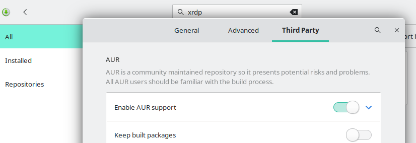
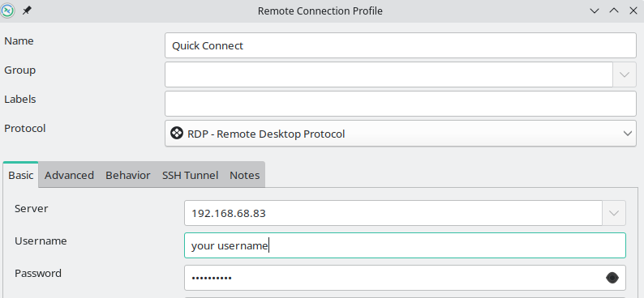
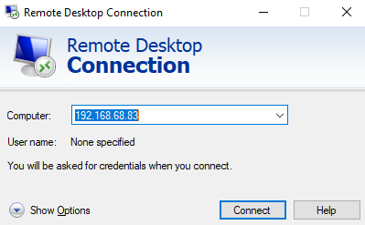

Maybe you have a headless Windows or Linux OS running on a Proxmox server or even running on bare metal. In either case, it's necessary to be able to remote into the desktop of the machine, whether that be Linux or Windows. Typically this is done via the remote desktop protocol on Windows or VNC on Linux. However, an open-source implementation of RDP exists as well, and it's called [XRDP](https://github.com/neutrinolabs/xrdp).

Today, we will compare both of these remote desktop protocols in terms of performance, security, and setup.

## What are XRDP and VNC?

XRDP and VNC are both popular remote desktop protocols that allow users to remotely connect to and control a computer from a different device. Both protocols have their own unique features and benefits, but how do they compare in terms of performance, security, and setup?

## What is XRDP?

First, let's define each protocol. XRDP is an open-source Remote Desktop Protocol (RDP) server that allows users to connect to a remote computer using RDP client software. XRDP is one option for setting up a remote desktop on a Linux workstation and packages are available for most distributions.

XRDP offers important features you would expect from RDP.

- Remote Desktop Viewing and Control

- Redirection audio output and input redirection

- Bi-directional clipboard

- Filesystem redirection, make local drives available on the remote machine

## What is VNC?

On the other hand, VNC (Virtual Network Computing) is a cross-platform remote desktop protocol that allows users to remotely access and control a computer from another device. It is also open-source and can be used on a variety of operating systems.

## XRDP and VNC Performance Comparison

Now, let's compare the performance of these two protocols. In terms of speed, XRDP tends to be faster than VNC. This is because XRDP uses RDP, which is a native Windows protocol and is therefore optimized for Windows environments. On the other hand, VNC uses a custom protocol, which can sometimes result in slower performance.

However, VNC has a few advantages over XRDP in terms of performance. First, VNC is more flexible and can be used on a wider variety of operating systems and devices. This makes it a good choice for users who need to access computers running different operating systems. Second, VNC has better support for high-resolution displays and can handle multiple monitors more effectively than XRDP.

## XRDP and VNC Security Comparison

In terms of security, both XRDP and specifically TigerVNC operate over TLS for their connections by default. This makes it more secure in terms of man-in-the-middle attacks but doesn't protect it from brute force attacks. For this reason, it is not advisable to have XRDP or VNC available openly on the internet. At the very least it should be behind a firewall that only allows connections from IP addresses that need it.

### SSH Tunnel

For better security, if the connection must be available over the internet, you should consider using an SSH tunnel for the connection. This process will be described in a later article but for now, if you are planning to connect via XRDP or VNC over the internet, you should research SSH tunnels before making it available.

## XRDP Setup

Now, let's talk about the setup process for each protocol. Setting up XRDP is relatively straightforward, especially on Windows. To set up XRDP on Windows, users simply need to install the XRDP software on the remote computer and then connect to it using an RDP client on the local computer. On Linux, the setup process is slightly more complex, but there are detailed instructions available online that make it easy to follow.

### XRDP Setup on Linux

The installation of XRDP is far easier than VNC, we just need to install and set up the service. Described below is the installation process for various distributions of Linux.

#### Install XRDP on Manjaro and Arch

To get started installing XRDP on Manjaro or Arch Linux distributions, you will need to enable the AUR repository. You can do this in the preferences of pamac, the GUI package manager.



Once the AUR is enabled, you have a few options. You can use the GUI package manager in Manjaro/Arch to install XRDP and xorgxrdp. Alternatively, you can use the yay AUR helper to install XRDP. If you don't have yay or some other AUR helper installed, you can install it with the following command.

```
sudo pacman -S yay
```

Once yay is installed, you can install XRDP and xorgxrdp with the following command.

```
yay -S xrdp xorgxrdp
```

After XRDP is installed, you will need to enable and start the service before you can successfully use RDP to connect.

```
sudo systemctl enable xrdp
sudo systemctl start xrdp
```

We need to edit the ~/.xinitrc file in order for KDE to launch properly in an XRDP session. Open up this file for editing and replace the line "exec $(get\_session "$1")" with the following:

```
/usr/lib/plasma-dbus-run-session-if-needed startplasma-x11
```

Save the edits to the file. Next, we need to create the file /etc/X11/Xwrapper.config if it doesn't already exist. Put the following contents in the file.

```
allowed_users=anybody
```

That's it, you now have XRDP setup on Manjaro or Arch Linux.

#### Install XRDP on Ubuntu 22.10

Installing and setting up XRDP on Ubuntu 22.10 is far easier than on Manjaro or Arch. Use apt to install the XRDP package.

```
sudo apt install xrdp
```

Now we just need to enable and start the XRDP service.

```
sudo systemctl enable xrdp
sudo systemctl start xrdp
```

That's all you need to do to get XRDP running on Ubuntu. You can now connect to your Ubuntu machine remotely using RDP.

#### Install XRDP on Fedora 37 and CentOS

To get started installing XRDP on Fedora 37, we need to install XRDP using the dnf package manager in the terminal.

```
sudo dnf install xrdp
```

Once installed, we need to enable and start the XRDP service so that it runs after each reboot of the system.

```
sudo systemctl enable xrdp
sudo systemctl start xrdp
```

You should now be able to connect using an RDP client. Some guides will mention SELinux changes, these are not necessary for connection within your local network. If you plan to connect over the internet, consider an SSH tunnel to decrease your security risk.

## VNC Setup

Setting up VNC can be a bit more complex, depending on the operating system being used. Check out our [guide on setting up VNC for Manjaro Linux](https://credibledev.com/install-vnc-on-manjaro-for-remote-access/).

## Connecting to XRDP

To connect to XRDP from Linux, you can use Rimmina, which makes the connection pretty easy. There are other RDP clients for Linux that you could check out as well.

- [Remmina](https://remmina.org/)

- [Vinagre](https://wiki.gnome.org/Apps/Vinagre)



If you are connecting to XRDP from a Windows device, you can use the built-in RDP application found in your start menu.



## Alternatives to XRDP and VNC

If you're not a techie or you don't want to do any command line work or configuration, you can check out these popular alternatives to XRDP and VNC. These solutions rely on third-party services and could expose your system to external risks. These applications are far easier to set up and configure though, which makes them a perfect solution for newer users of remote desktop functionality.

[TeamViewer](https://www.teamviewer.com/en-us/)

[AnyDesk](https://anydesk.com/en)

## Conclusion

Overall, both XRDP and VNC are reliable and effective remote desktop protocols, and the choice between the two will depend on the specific needs and preferences of the user.

In conclusion, XRDP is generally faster and more secure, but VNC is more flexible and has better support for high-resolution displays. Both protocols have their own unique features and benefits, and the choice between the two will depend on the specific needs and preferences of the user.
